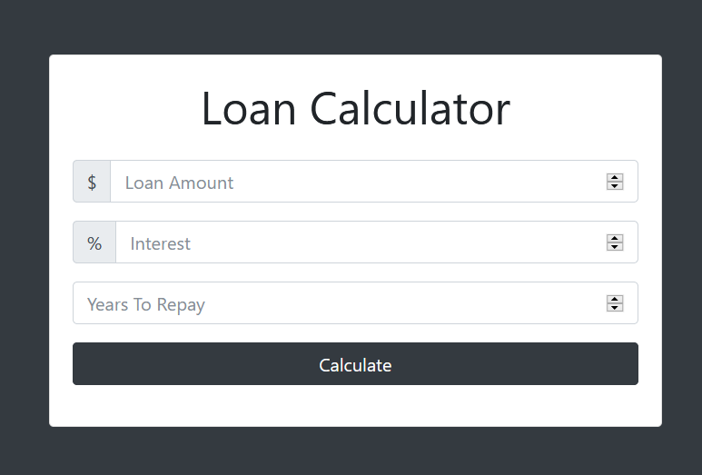

# Loan Calculator App
This is a Loan Calculator Application created using Html, Css, Javascript, and Bootstrap4

## Developed By
> Nishkarsh Dubb

## Screenshots


## Developed using
* Html
* css
* javascript
* bootstrap4

## Setup:

#### Clone this repository:

```bash
git clone https://github.com/Nishkarsh01/loan-calculator-app.git
```
or download the zip file from github.

After extracting the files, 

* 1  .``cd loan-calculator-app`` 
* 2  .``open index.html``

## Collaborate
To collaborate, reach me on [nishdubb11@gmail.com]()

## Further help

To get more help on the Javascript go check out the [MDN Javascript Documentation](https://developer.mozilla.org/en-US/docs/Web/JavaScript).

